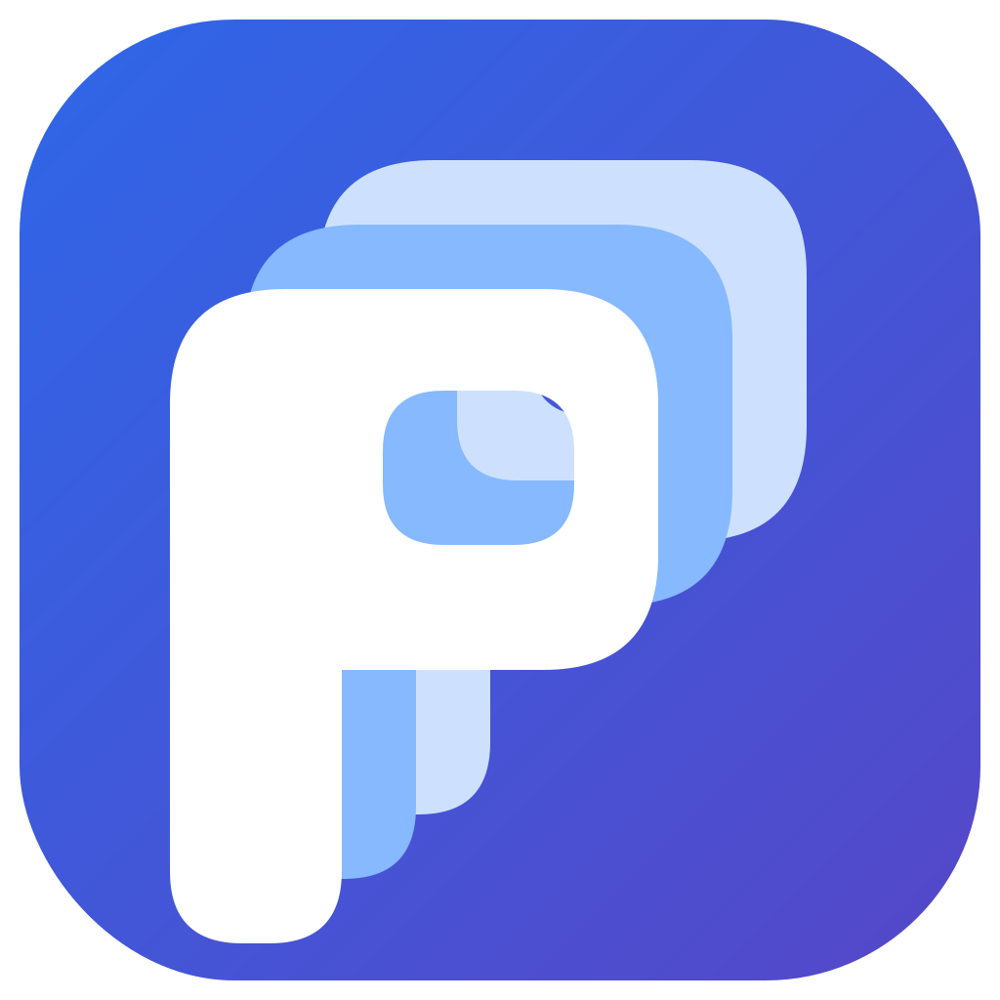

# Plan

<p align="center">
  
</p>

<p align="center">
  <strong>Plan – tavler til overblik og læring</strong>
</p>

**Plan er lærerens lokale arbejds-, planlægnings- og præsentationsmiljø til hele undervisningsforløb.**

I Plan kan du samle årsplaner, sessioner, tavler, materialer, aktiviteter, elevdata, grupper, fagsamtaler, karakterarbejde, kalender og noter i ét sammenhængende forløb.

Plan bruges direkte i browseren. Der kræves hverken login, elevkonti, installation eller en central server. Arbejdet gemmes lokalt på lærerens enhed, og læreren bestemmer selv, hvad der vises, deles, eksporteres og gemmes.

Plan bygger videre på den fleksible tavleform fra **Tavle**, men sætter hele undervisningsforløbet i centrum: fra årsplan og sessioner til konkrete tavler, data, elevforløb og evaluering.

---

## Åbn Plan

### Brug Plan online

Åbn Plan direkte i browseren:

https://plan.måns.dk/

### Brug Plan som lokal HTML-app

Plan kan også åbnes direkte som en selvstændig HTML-fil uden server, installation eller internetforbindelse.

1. Hent den aktuelle Plan-fil.
2. Gem den et sikkert sted på enheden.
3. Åbn HTML-filen i en moderne browser eller en egnet lokal HTML-app.

Selve Plan-appen er bygget som én selvstændig HTML-fil. Et fuldt GitHub-repository kan desuden indeholde appikoner, webmanifest, bibliotekskatalog og demoforløb, men disse filer er ikke nødvendige for at åbne og bruge den lokale kerneapp.

På iPad kan den online udgave føjes til hjemmeskærmen. Lokale HTML-filer kan også bruges gennem en app, der understøtter lokal browserlagring.

> **Vigtigt:** Browserlagring hører til den browser, app eller webadresse, hvor Plan åbnes. Tag derfor jævnligt backup, især før du skifter browser, app, enhed eller rydder lokalt lager.

---

## Plan i fire niveauer

Plan organiserer undervisningen i fire niveauer:

1. **Undervisningsforløb** – for eksempel *Dansk 2026–27*
2. **Sessioner** – for eksempel *Familien*, *Frihed og flugt* eller *Mundtlig prøve*
3. **Tavler** – de konkrete arbejdsflader i en session
4. **Widgets** – tekst, billeder, PDF, data, aktiviteter og andet indhold på tavlen

Et undervisningsforløb kan dermed rumme både den langsigtede plan, rækkefølgen mellem sessionerne og det materiale, der skal bruges i den enkelte undervisningstime.

Når Plan åbner, kan du fortsætte det senest brugte forløb, gå til næste session, vælge en anden session eller åbne oversigten over alle undervisningsforløb.

---

## Fra planlægning til undervisning

Et undervisningsforløb kan blandt andet indeholde:

- årsplan og fælles kalender
- sessioner i kronologisk rækkefølge
- starttavler og dagsprogrammer
- lærerens oplæg og instruktioner
- opgaver, links og PDF-materialer
- billeder, video og lyd
- elev-, gruppe- og tavleoverblik
- aktiviteter og repetition
- opsamling, evaluering og noter
- reserveindhold og alternative veje

Tavlerne kan bruges som sider i et forløb, men de er samtidig frie arbejdsflader. Widgets kan flyttes, ændres i størrelse, roteres, låses, skjules, minimeres og maksimeres.

Plan kan derfor tilpasses, mens undervisningen er i gang, uden at læreren er bundet til en fast præsentation.

### Arbejdsformer

- **Redigering** bruges til at opbygge og ændre tavlen.
- **Præsentation** skjuler redigeringsgrejet og giver en roligere fælles visning.
- **Fokus** fremhæver én widget ad gangen.
- **Maksimering** lader én widget fylde arbejdsfladen.
- **Tavleskift** fører gennem sessionens tavler.
- **Widgetvælgeren** gør det hurtigt at finde og fokusere et bestemt element.

Plan kan dermed bruges til forberedelse, fælles gennemgang, aktivitet, individuel samtale og evaluering fra det samme miljø.

---

## Dansk – fra elevsvar til hold, samtaler og karakterer

Plan kan samle et helt danskfagligt arbejdsforløb uden at blande de oprindelige datakilder sammen.

En typisk arbejdsgang er:

1. Importér **Elevstamdata**.
2. Importér spørgeskemaer, lærerark og samtaleark som separate datakilder.
3. Opret en **Niveaudelingsmatrix**.
4. Gennemgå eleverne og placér dem på Hold 1, Hold 2 eller Hold 3.
5. Arbejd videre fra **Mit danskhold**.
6. Gennemfør **Fagsamtaler**.
7. Giv og eksporter **Standpunktskarakterer**.

### Niveaudeling

Niveaudelingsmatrixen samler elevens svar, importerede læreroplysninger og lærerens egne vurderinger i en overskuelig elevgennemgang.

Elevens oprindelige svar ændres ikke. Plans anbefalinger, placeringer, begrundelser og historik gemmes særskilt.

De tre danskhold er levende grupper. Når en elev flyttes, opdateres holdet uden at oprette en ny kopi. Holdene kan åbnes som lister, kort, tavler eller i Gruppegalaksen.

### Mit danskhold

**Mit danskhold** er lærerens arbejdsvisning af det aktuelle hold.

Herfra kan læreren blandt andet åbne:

- Elevkortmatrix
- holdets data
- arbejdsgrupper
- gruppevisninger
- Fagsamtaler
- Standpunktskarakterer

Holdet er en relation til de eksisterende elever og datakilder – ikke en ukontrolleret kopi af alle oplysninger.

### Fagsamtaler

Fagsamtaler kan samle elevens skrivebeskyttede spørgeskemasvar med lærerens egne vurderinger, kommentarer og status.

Plan understøtter blandt andet:

- blandede hold med 9. og 10. klasse
- forskellige samtaleprofiler for Dansk 9 og Dansk 10
- flere samtaleark
- manuel elevmatch
- forkortede navne
- automatisk gemning
- eksport til kontaktlærere
- kopiering af lærerens danskblok tilbage til svararket

Elevens svar forbliver urørte. Lærerens fagsamtalesvar gemmes særskilt i Plan.

### Standpunktskarakterer

Karakterarbejdet er adskilt fra både elevens egne forslag, niveaudelingen og fagsamtalens lærerkommentarer.

Plan understøtter:

- Efterår
- Forår
- Afsluttende standpunkt
- 9.-klassefelter
- FP9 og FP10
- skriftligt og mundtligt prøveniveau
- karakterhistorik
- lærerbemærkning
- filtrering
- eksport til CSV

Den afsluttende standpunktskarakter er en ny faglig vurdering og beregnes ikke automatisk som et gennemsnit af tidligere terminer.

### Ens elevnavigation

I fulde elevvisninger bruges den samme grundmodel:

- `↑` og `↓` skifter elev
- `←` og `→` skifter fane eller termin
- `Page Up` og `Page Down` ruller i den aktuelle visning

Når markøren står i et tekst-, karakter- eller valgfelt, beholder feltet sine egne taster.

---

## Data og Datacenter

Plan kan bruge regneark, CSV-filer, kalenderfiler, lister og fælles datakilder som grundlag for mange arbejdsgange.

Du kan blandt andet:

- vise et datasæt som DataWidget
- importere CSV- og XLSX-filer
- vælge mellem flere ark i samme projektmappe
- oprette lister ud fra data
- genbruge samme kilde i flere widgets
- filtrere, sortere og sammensætte data med DataRemix
- bruge navnelister i Grupper og Lykkehjulet
- oprette Elevkort og Elevkortmatricer
- koble spørgeskemaer, vurderinger og Elevstamdata
- danne grupper og gruppetavler
- koble kalenderdata og ICS-filer
- se relationer mellem objekter, visninger og datakilder

### Separate kilder med relationer

Plan forsøger at bevare data som separate, tydelige kilder:

- Elevstamdata
- spørgeskemaer
- lærervurderinger
- fagsamtaler
- karakterer
- grupper og hold

Stabile elev-id’er bruges, når de findes. Navn og klasse kan bruges som forsigtig midlertidig fallback. Tekniske id’er vises ikke i den almindelige brugerflade.

### Datacenterets faner

Datacenter samler blandt andet:

- Årsforløb
- Bibliotek
- Sessioner
- Sessionsdata
- Fælles data
- Datakilder
- DataRemix
- Relationer
- Medier
- Gendannelse
- Lager
- Fagforløb

**Sessionsdata** hører til den aktuelle session.  
**Fælles data** kan bruges på tværs af sessioner og undervisningsforløb.

Datacenter åbnes med `D`. Hjælp i appen beskriver den fulde tastatur- og touchbetjening.

---

## Elevkort, grupper og overblik

### Elevkort

Fra et egnet Elevstamdatasæt kan du oprette:

- enkelte Elevkort
- en Elevkortmatrix
- elevtavler
- elevnoter
- noteoversigter

Elevkort kan vise elevens egne oplysninger samt fanerne **Elev**, **Mor**, **Far** og **Notater**.

Elevkort kan beriges dynamisk fra Elevstamdata, mens spørgeskemaer, vurderinger og hold fortsat er selvstændige kilder.

### Grupper

GruppeWidget kan:

- hente deltagere fra en liste eller et datasæt
- danne grupper
- låse deltagere eller roller
- oprette tomme grupper
- dele en eksisterende gruppe
- oprette gruppetavler
- vise grupper som matrix eller i Gruppegalaksen

GruppeWidgetten er hovedkilden. Når medlemmer, roller eller gruppenavne ændres, kan de tilknyttede Gruppekort og gruppetavler følge med.

En gemt gruppering åbnes i Gruppegalaksen som den samme gruppering. Der oprettes ikke automatisk en ny kopi.

### Kort og matricer

Plan kan samle relaterede elementer i oversigter som:

- Elevkortmatrix
- Niveaudelingsmatrix
- Fagsamtalematrix
- Karaktermatrix
- Gruppekortmatrix
- TavleKortmatrix
- Billedmatrix
- Videomatrix
- Lydmatrix
- Gruppegalaksen

Kortene er kompakte i oversigten og kan åbnes i en større detaljevisning.

---

## Materialer og medier

Du kan vælge eller trække én eller mange filer ind i Plan. Appen forsøger selv at vælge en passende widgettype.

Det kan blandt andet være:

- billeder
- video
- lyd
- PDF
- regneark og CSV
- tekstfiler
- kalenderfiler
- HTML-apps
- backup- og forløbspakker

### Billeder, video og lyd

En enkelt mediefil åbnes som en almindelig widget.

Når flere filer af samme type importeres samlet, kan Plan samle dem i:

- Billedmatrix
- Videomatrix
- Lydmatrix

Plan monterer kun den aktuelle side af store mediematricer for at reducere hukommelsesforbruget.

I **Datacenter → Medier** kan enkelte filer hentes igen. Plan forsøger at beskytte medier, der fortsat bruges af andre sessioner, forløb, datasæt eller gendannelsespunkter.

### PDF

PDF-filer åbnes som PDF-widgets med sidevisning, formularfelter, links, scrolling og kantbladring.

PDF kan blandt andet bruges til:

- opgaveark og prøveoplæg
- formularer
- elevbesvarelser
- anonym afstemningsindsamling
- fælles gennemgang
- materialer, der skal bevare deres oprindelige layout

### HTML-apps

Plan kan indlejre selvstændige HTML-apps som blandt andet:

- Plan
- Tavle
- Skriv
- Tjek
- TiddlyWiki
- andre lokale eller webbaserede HTML-apps

Aktive HTML-apps kan minimeres og gendannes uden at miste deres aktuelle tilstand.

---

## Aktiviteter

Plan rummer blandt andet:

- **KaPardy** til quiz, repetition og holdkonkurrence
- **Grupper** til gruppedannelse og gruppearbejde
- **Lykkehjulet** til tilfældige eller lærerbestemte valg
- **Afstemning** til fælles respons og anonym PDF-baseret indsamling
- **Ordsky** til idéer, begreber og opsamling
- **Timer og stopur** til arbejdsperioder, sekvenser og mellemtider
- **Kalender** til dagsprogram, ugeplan og årsplan

Aktiviteterne kan bruge data og lister, som allerede findes i forløbet.

KaPardy bevarer kompatibilitet med ældre spilbanker, hvor det første svar efter spørgsmålet er korrekt, og de tre næste er forkerte. Svarene blandes ved spilstart.

---

## Kalender og bibliotek

Kalenderen kan bruges til:

- dagsprogram
- ugeskema
- månedsoverblik
- skoleår og forløbsplan
- rejser og projektuger
- arrangementer og særlige skoledage

Kalenderdata kan oprettes direkte, hentes fra et datasæt eller importeres fra en `.ics`-fil.

Plan har desuden et bibliotek med undervisningsforløb og skabeloner.

Åbn biblioteket via:

**Plan-ikonet eller forløbsnavnet → Alle undervisningsforløb → Hent demoforløb**

Et bibliotekseksemplar importeres som en selvstændig lokal kopi. Lærerens ændringer påvirker ikke filen i biblioteket.

Bibliotekets tekniske vejledning findes i:

```text
plan-library/README.md
```

---

## Lokal lagring, backup og gendannelse

Plan gemmer arbejdet lokalt i browseren.

Du kan blandt andet bruge:

- **Backup** til den aktuelle session
- **Backup+** med tilknyttede data og medier
- **Backup++** til flere sessioner
- **Årsforløbspakker** til et helt undervisningsforløb
- **Sessionpakker** til udvalgte tavler
- **Papirkurv** til slettede widgets
- **Gendannelsespunkter** til tidligere tilstande
- **Tavleshots** til øjebliksbilleder
- **Lagerredning** ved gemmefejl eller pladsmangel

Plan kontrollerer lagringen før større forløbs- og sessionsskift. Hvis browseren ikke kan gemme, bliver det aktuelle arbejde stående åbent, og Lagerredning tilbyder nødbackup, sikker oprydning og nyt gemmeforsøg.

Under **Datacenter → Lager** findes også en særskilt mulighed for at nulstille Plans lokale lager. Den er kun beregnet til situationer, hvor browserens lokale lager er blevet fastlåst eller ødelagt.

> Tag backup før oprydning eller nulstilling. En lokal HTML-app er kun så sikker som den seneste backup, du faktisk har gemt uden for browseren.

---

## Lærerens lokale arbejdsrum

Plan er først og fremmest lærerens eget undervisningsmiljø.

Det betyder:

- ingen login
- ingen elevkonti
- ingen central database
- ingen indbygget aflevering eller beskedsystem
- lokal kontrol over data og medier
- læreren bestemmer, hvad der vises, deles og eksporteres

Materialer kan udleveres og modtages gennem skolens eksisterende tjenester.

Plan er ikke afhængig af, at eleverne bruger Plan på deres egne enheder.

---

## Kompatibilitet med Tavle

Plan er et nyt produktnavn og en mere sammenhængende forløbsmodel, men arbejdsfladerne hedder fortsat **tavler**.

Plan bevarer så vidt muligt kompatibilitet med den klassiske Tavle, herunder:

- tavler og widgets
- sessioner
- data og medier
- PDF
- KaPardy-spil og spilbanker
- backup- og importformater

Ved import kan Plan omforme ældre indhold til den nye model uden unødige navne- eller formatbrud.

---

## Hjælp i appen

README-filen er den overordnede introduktion. Den indbyggede **Hjælp** er den praktiske vejledning, mens du arbejder.

Hjælp indeholder blandt andet:

- undervisningsforløb, sessioner og tavler
- widgets og filimport
- data og Datacenter
- Elevstamdata og Elevkort
- Niveaudeling og danskhold
- Fagsamtaler
- Standpunktskarakterer
- grupper og Gruppegalaksen
- aktiviteter
- medier og PDF
- backup, Lagerredning og gendannelse
- tastatur, touch og præsentation

Hjælpen kan betjenes med tastaturet:

- `←` og `→` skifter hjælpeafsnit
- `↑` og `↓` scroller
- `Enter` åbner eller vælger
- `B` skifter tema
- `Esc` lukker eller går tilbage

---

## Browserapp og iPad

Plan er udviklet med fokus på:

- touch og mus
- tastatur og SmartBoard
- lokal lagring
- store undervisningsforløb
- kontrolleret indlæsning af data og medier
- arbejde uden krav om login

Den online udgave indeholder webapp-manifest og appikoner og kan føjes til hjemmeskærmen på understøttede enheder.

Lokal lagring på iPad afhænger af den browser eller lokale HTML-app, hvor Plan åbnes. Backup bør derfor være en fast del af arbejdsgangen.

---

## Repository og filer

Et fuldt Plan-repository kan blandt andet indeholde:

- `index.html` – den aktuelle Plan-app
- `README.md` – denne introduktion
- `plan.webmanifest` – webapp-manifest
- `plan-assets/` – logo og appikoner
- `plan-library/` – bibliotek med undervisningsforløb
- `plan-library/catalog.json` – bibliotekets register
- `plan-library/README.md` – teknisk biblioteksvejledning

Den lokale kerneapp kan fortsat distribueres og bruges som én selvstændig HTML-fil.

---

## Kort fortalt

**Plan – tavler til overblik og læring** samler lærerens:

- årsplaner og undervisningsforløb
- sessioner og tavler
- materialer og medier
- lister, data og relationer
- Elevstamdata og Elevkort
- niveaudeling og levende hold
- Fagsamtaler
- Standpunktskarakterer
- grupper og aktiviteter
- kalender og præsentation
- backup, gendannelse og genbrug

i én lokal browserapp, der kan tilpasses undervisningen, mens den foregår.
