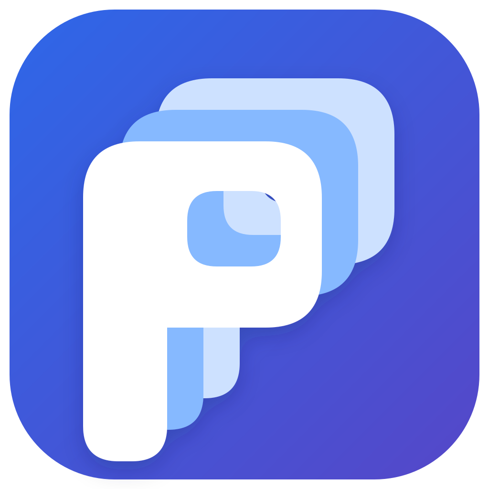

# Plan 1.0.9

  

  <strong>Plan – tavler til overblik og læring</strong>

**Plan er lærerens lokale arbejds-, planlægnings- og præsentationsmiljø til hele undervisningsforløb.**

I Plan kan du samle årsplan, kalender, sessioner, tavler, materialer, aktiviteter, elevdata, hold, grupper, fagsamtaler, karakterarbejde, noter, kilder, medier, KaPardy-spil og huskekort i ét sammenhængende forløb.

Plan bruges direkte i browseren. Der kræves hverken login, elevkonti eller central server. Arbejdet gemmes lokalt på lærerens enhed, og læreren bestemmer selv, hvad der vises, deles, eksporteres og gemmes.

Plan bygger videre på den fleksible tavleform fra **Tavle**, men sætter hele undervisningsforløbet i centrum: fra skoleårets kalender og sessionernes rækkefølge til den enkelte tavle, elevgruppe, kilde, aktivitet og evaluering.

---

## Nyt i 1.0.8

Plan 1.0.9 samler de seneste ændringer i hjælp, README, bibliotek og læringsaktiviteter:

- **Hjælp og README** er opdateret til den aktuelle version.
- **Biblioteket** viser nu fag ud fra kataloget og har faste synlige fag for blandt andet **Musik** og **Historie**.
- **Andre 9.-klassefag** er nu kun en restkategori for øvrige 9.-klassefag, ikke en skjult placering for Musik og Historie.
- **KaPardy** kan bruges som almindeligt spil og som læringsbank.
- **Huskekort** og **Huskekortmatrix** kan bruges til aktiv genkaldelse, begrebstræning og repetition før KaPardy.
- **Huskekortmatrix** kan være en levende visning af samme KaPardy-spørgsmålsbank uden at kopiere spørgsmålene.
- Kilder fra huskekort åbnes som midlertidige kildevinduer, medmindre læreren udtrykkeligt vælger at fastgøre dem på tavlen.
- Professorforløb kan nu bygges omkring kilder, medier, huskekort, arbejdsopgaver og KaPardy på sidste tavle.

---

## Åbn Plan

### Brug Plan online

Åbn Plan direkte i browseren:

https://plan.måns.dk/

### Brug Plan som lokal HTML-app

Plan kan også åbnes som én selvstændig HTML-fil uden server eller internetforbindelse.

1. Hent den aktuelle `index.html`.
2. Gem den et sikkert sted på enheden.
3. Åbn HTML-filen i en moderne browser eller en egnet lokal HTML-app.

Den online udgave kan desuden rumme appikon, færdige undervisningsforløb og KaPardy-spil. Den lokale HTML-fil kan bruges alene, men bibliotek og spil fungerer bedst i den online udgave.

På iPad kan den online udgave føjes til hjemmeskærmen. Lokale HTML-filer kan bruges gennem en app, der understøtter lokal browserlagring.

> **Vigtigt:** Browserlagring hører til den browser, app eller webadresse, hvor Plan åbnes. Tag derfor jævnligt backup, især før du skifter browser, app, enhed eller rydder lokalt lager.

---

## Plan i fire niveauer

Plan organiserer undervisningen i fire niveauer:

1. **Undervisningsforløb** – for eksempel *Dansk 2026–27* eller *20 spørgsmål fra professoren · Matematik*.
2. **Sessioner** – for eksempel *Familien*, *Frihed og flugt*, *Huskekort og aktiv genkaldelse* eller *Mundtlig prøve*.
3. **Tavler** – de konkrete arbejdsflader i en session.
4. **Widgets** – tekst, billeder, PDF, data, kilder, aktiviteter og andet indhold på tavlen.

Kalenderen binder niveauerne sammen. En kalenderaktivitet kan pege på et fagligt planpunkt, et hold, arbejdsgrupper og én eller flere tavler.

Når Plan åbner, kan du fortsætte det senest brugte forløb, gå til næste session, vælge en anden session eller åbne oversigten over alle undervisningsforløb.

---

## Biblioteket

Plan har et bibliotek med undervisningsforløb og skabeloner.

Åbn biblioteket via:

**Plan-ikonet eller forløbsnavnet → Alle undervisningsforløb → Hent demoforløb**

eller:

**Datacenter → Bibliotek**

Et bibliotekseksemplar importeres som en selvstændig lokal kopi. Lærerens ændringer påvirker ikke filen i biblioteket.

### Fag i biblioteket

Biblioteket viser forløbene samlet efter fag, så læreren hurtigt kan finde det rigtige materiale.

Aktuelle hovedfag kan blandt andet være:

- Dansk
- Engelsk
- Matematik
- Science
- Tysk
- Musik
- Historie
- Andre 9.-klassefag
- Andre

**Musik** og **Historie** er selvstændige fag i biblioteket. Balkanmusik og Musikgenrer hører derfor til Musik, mens Verdenskrigenes historie hører til Historie.

**Andre 9.-klassefag** er en restkategori til fag som samfundsfag, geografi, biologi, kristendom, idræt/gymnastik og praktisk-kreative fag, hvis de ikke har egne fagknapper.

### Professorforløb

Professorforløbene er korte kildebaserede undervisningsforløb, der leder frem mod et 20-spørgsmåls KaPardy-spil.

Et typisk professorforløb indeholder:

1. overblik over forløbet,
2. kilde- og medieliste,
3. faglige arbejdstavler,
4. læsning, lytning, kig, samtale eller opgaver,
5. huskekortmatrix,
6. prøveværksted,
7. KaPardy på sidste tavle.

Målet er, at eleverne ikke blot møder spørgsmålene som quiz, men arbejder med kilder, begreber, forklaringer og forvekslinger inden spillet.

---

## KaPardy, læringsbank og huskekort

KaPardy kan bruges som spil, men kan også fungere som en spørgsmålsbank for læring.

### KaPardy

KaPardy kan bruge:

- færdige spil fra Plans spilbibliotek,
- CSV- og Excel-filer fra disk,
- en eksisterende lokal spørgsmålsbank,
- spørgsmål, der skrives og redigeres direkte i widgetten.

KaPardy bevarer kompatibilitet med den klassiske spilbankaftale: det første svar efter spørgsmålet er korrekt, og de tre næste er forkerte. I Kahoot-visningen blandes svarene ved spilstart og får tydelige farver, så holdene kan svare eksempelvis **Blå**, **Rød**, **Gul** eller **Grøn**.

### Huskekort

Et **Huskekort** er et vendekort med forside, bagside, forklaring, hint, kilde, forvekslinger og status.

Det kan bruges til:

- begreber,
- personer,
- årstal,
- fagord,
- billeder,
- citater,
- kilder,
- korte forklaringer,
- repetition før spil.

### Huskekortmatrix

En **Huskekortmatrix** samler mange huskekort og kan vise dem som overblik eller som træning ét kort ad gangen.

Matrixen kan blandt andet bruges til:

- aktiv genkaldelse,
- pararbejde,
- fælles repetition,
- “kan / næsten / kan ikke endnu”-markering,
- kategorifiltrering,
- kildeberigelse,
- forberedelse til KaPardy.

En huskekortmatrix kan være en **levende visning af en KaPardy-bank**. Så kopieres spørgsmålene ikke som standard. Matrixen gemmer kun læringslaget: status, hints, forklaringer, kilder og eventuelle ekstra kort.

Hvis læreren vil gøre matrixen uafhængig af KaPardy-spillet, kan den afkobles som lokal kopi.

### Kilder i huskekort

Når en kilde åbnes fra et huskekort, åbnes den som udgangspunkt som et midlertidigt kildevindue. Det betyder:

- vinduet kan lukkes med X,
- intet sendes i Papirkurv,
- der oprettes ikke en permanent widget,
- forløbspakken ændres ikke.

Hvis kilden skal blive på tavlen, vælger læreren at fastgøre den som widget.

---

## Byg årsplanen med kalenderen

Kalenderen kan åbnes fra alle tavler med kalenderknappen ved uret eller med `K`.

Den kan vises som **Dag**, **Uge**, **Måned** eller **Liste** og kan bruges både til skolens importerede kalender og lærerens egen faglige plan.

### Knyt tavler til datoer og aktiviteter

- Vælg en eksisterende kalenderaktivitet og brug **Knyt aktuel tavle**.
- På en tom dato kan du oprette et lokalt planpunkt med titel og eventuelt tidspunkt.
- Tomme datoer er klappet sammen, indtil du vælger at planlægge dem.
- En aktivitet kan have flere tavler. Du behøver derfor ikke oprette flere ens aktiviteter på samme dato.
- I Dag og Liste er 1–5 tilknyttede tavler foldet ud som standard. Ved flere end fem kan listen åbnes efter behov.

Når en ny tavle oprettes fra et tavleforløb, placeres den efter den aktive tavle og fortsætter samme kalenderaktivitet eller planpunkt. Den nye tavle er tom, men arver tavlens grundudseende. **Duplikér tavle** kopierer også indholdet.

### Tid, hold og grupper

Det oprindelige faglige forløb kan godt være oprettet uden klokkeslæt. Når det kobles til en importeret kalender, vises kalenderens konkrete start- og sluttider sammen med planpunktets faglige titel.

En aktivitet kan desuden knyttes til:

- et levende faghold eller elevudvalg,
- eksisterende arbejdsgrupper,
- nye arbejdsgrupper dannet fra holdet,
- flere tavler i den rækkefølge, de skal bruges.

Fra **Arbejd med holdet** kan læreren blandt andet åbne Elevkortmatrix, Lykkehjul, arbejdsgrupper, Fagsamtaler og karakterer.

---

## Fra planlægning til undervisning

Et undervisningsforløb kan blandt andet indeholde:

- årsplan og kalender,
- sessioner i kronologisk rækkefølge,
- starttavler og dagsprogrammer,
- lærerens oplæg og instruktioner,
- opgaver, links og PDF-materialer,
- billeder, video og lyd,
- elev-, gruppe- og tavleoverblik,
- kilder og medielister,
- huskekort og aktiv genkaldelse,
- KaPardy og andre aktiviteter,
- opsamling, evaluering og noter,
- reserveindhold og alternative veje.

Tavlerne kan bruges som sider i et forløb, men de er samtidig frie arbejdsflader. Widgets kan flyttes, ændres i størrelse, roteres, låses, skjules, minimeres og maksimeres.

Plan kan derfor tilpasses, mens undervisningen er i gang, uden at læreren er bundet til en fast præsentation.

### Arbejdsformer

- **Redigering** bruges til at opbygge og ændre tavlen.
- **Præsentation** skjuler redigeringsgrejet og giver en roligere fælles visning.
- **Fokus** fremhæver én widget ad gangen.
- **Maksimering** lader én widget fylde arbejdsfladen.
- **Tavleskift** fører gennem sessionens tavler.
- **Widgetvælgeren** gør det hurtigt at finde og fokusere et bestemt element.
- **Redningsbæltet** kan nulstille visningen, finde vinduer og foreslå et nyt arrangement uden at ændre widgetternes indhold.

---

## Data og Datacenter

Plan kan bruge regneark, CSV-filer, kalenderfiler, lister og fælles datakilder som grundlag for mange arbejdsgange.

Du kan blandt andet:

- vise et datasæt som DataWidget,
- importere CSV- og XLSX-filer,
- vælge mellem flere ark i samme projektmappe,
- oprette lister ud fra data,
- genbruge samme kilde i flere widgets,
- filtrere, sortere og sammensætte data med DataRemix,
- bruge navnelister i Grupper og Lykkehjulet,
- oprette Elevkort og Elevkortmatricer,
- koble spørgeskemaer, vurderinger og Elevstamdata,
- danne grupper og gruppetavler,
- importere og genbruge kalenderdata fra ICS-filer,
- se relationer mellem objekter, visninger og datakilder.

Datacenter åbnes med `D` og samler blandt andet Årsforløb, Bibliotek, Sessioner, Sessionsdata, Fælles data, Datakilder, DataRemix, Relationer, Medier, Gendannelse og Lager.

---

## Dansk – fra elevsvar til hold, samtaler og karakterer

Plan kan samle et helt danskfagligt arbejdsforløb uden at blande de oprindelige datakilder sammen.

En typisk arbejdsgang er:

1. Importér **Elevstamdata**.
2. Importér spørgeskemaer, lærerark og samtaleark som separate datakilder.
3. Opret en **Niveaudelingsmatrix**.
4. Gennemgå eleverne og placér dem på Hold 1, Hold 2 eller Hold 3.
5. Arbejd videre fra **Mit danskhold**.
6. Knyt holdet til relevante kalenderaktiviteter.
7. Gennemfør **Fagsamtaler**.
8. Giv og eksporter **Standpunktskarakterer**.

Elevens oprindelige svar ændres ikke. Plans anbefalinger, placeringer, begrundelser, fagsamtaler og karakterer gemmes særskilt.

---

## Elevkort, grupper og overblik

Fra et egnet Elevstamdatasæt kan du oprette:

- enkelte Elevkort,
- en Elevkortmatrix,
- elevtavler,
- elevnoter,
- noteoversigter.

GruppeWidget kan hente deltagere fra en liste, et datasæt eller et faghold, danne grupper, låse deltagere eller roller, oprette tomme grupper, dele en eksisterende gruppe, oprette gruppetavler og knytte et gruppesæt til et kalenderpunkt.

En gemt gruppering åbnes i Gruppegalaksen som den samme gruppering. Der oprettes ikke automatisk en ny kopi.

Plan kan desuden samle relaterede elementer i matrixer: Elevkortmatrix, Niveaudelingsmatrix, Fagsamtalematrix, Karaktermatrix, Gruppekortmatrix, TavleKortmatrix, Billedmatrix, Videomatrix, Lydmatrix, PDF-matrix og Huskekortmatrix.

---

## Materialer og medier

Du kan vælge eller trække én eller mange filer ind i Plan. Appen forsøger selv at vælge en passende visning.

Det kan blandt andet være:

- billeder,
- video,
- lyd,
- PDF,
- regneark og CSV,
- tekstfiler,
- kalenderfiler,
- HTML-apps,
- backup- og forløbspakker.

En enkelt mediefil åbnes som en almindelig widget. Flere filer af samme type kan samles i Billedmatrix, Videomatrix eller Lydmatrix.

PDF-filer åbnes som PDF-widgets med sidevisning, formularfelter, links, scrolling og kantbladring.

Plan kan også indlejre selvstændige HTML-apps som Plan, Tavle, Skriv, Tjek, TiddlyWiki og andre lokale eller webbaserede HTML-apps.

---

## Lokal lagring, backup og gendannelse

Plan gemmer arbejdet lokalt i browseren.

Du kan blandt andet bruge:

- **Backup** til den aktuelle session,
- **Backup+** med tilknyttede data og medier,
- **Backup++** til én, flere eller alle sessioner,
- **Årsforløbspakker** til et helt undervisningsforløb,
- **Sessionpakker** til udvalgte tavler, elevtavler, gruppetavler eller matricer,
- **Papirkurv** til slettede widgets og tavler,
- **Gendannelsespunkter** til tidligere tilstande,
- **Lagerredning** ved gemmefejl eller pladsmangel.

Plan kontrollerer lagringen før større forløbs- og sessionsskift. Hvis browseren ikke kan gemme, bliver det aktuelle arbejde stående åbent, og Lagerredning tilbyder nødbackup, sikker oprydning og et nyt gemmeforsøg.

> Tag backup før oprydning eller nulstilling. En lokal HTML-app er kun så sikker som den seneste backup, du faktisk har gemt uden for browseren.

---

## Lærerens lokale arbejdsrum

Plan er først og fremmest lærerens eget undervisningsmiljø.

Det betyder:

- ingen login,
- ingen elevkonti,
- ingen central database,
- ingen indbygget aflevering eller beskedsystem,
- lokal kontrol over data og medier,
- læreren bestemmer, hvad der vises, deles og eksporteres.

Materialer kan udleveres og modtages gennem skolens eksisterende tjenester.

Plan er ikke afhængig af, at eleverne bruger Plan på deres egne enheder.

---

## Kompatibilitet med Tavle

Plan er et nyt produktnavn og en mere sammenhængende forløbsmodel, men arbejdsfladerne hedder fortsat **tavler**.

Plan bevarer så vidt muligt kompatibilitet med den klassiske Tavle, herunder:

- tavler og mange almindelige widgettyper,
- sessioner,
- data og medier,
- PDF,
- KaPardy-spil og spilbanker,
- backup- og importformater.

Ved import kan Plan omforme ældre indhold til den nye model. Indhold, som ikke har en sikker direkte Plan-udgave, bør kontrolleres efter importen.

---

## Hjælp i appen

README-filen er den overordnede introduktion. Den indbyggede **Hjælp** er den praktiske vejledning, mens du arbejder. Her vises også den aktuelle Plan-version.

Hjælp indeholder blandt andet:

- undervisningsforløb, sessioner og tavler,
- kalender, planpunkter, hold og grupper,
- widgets og filimport,
- data og Datacenter,
- Elevstamdata og Elevkort,
- Niveaudeling og danskhold,
- Fagsamtaler,
- Standpunktskarakterer,
- KaPardy, Huskekort og andre aktiviteter,
- medier og PDF,
- backup, Lagerredning og gendannelse,
- tastatur, touch og præsentation.

Hjælpen kan betjenes med tastaturet:

- `←` og `→` skifter hjælpeafsnit,
- `↑` og `↓` scroller,
- `Enter` åbner eller vælger,
- `B` skifter tema,
- `Esc` lukker eller går tilbage.

---

## Onlineudgave og lokalt arbejde

Plan kan bruges direkte online eller som en lokal HTML-fil. Den online udgave giver lettest adgang til bibliotek, demoforløb og KaPardy-spil. Den lokale fil er praktisk, når du vil arbejde uden net eller gemme en bestemt version på din egen enhed.

Uanset hvordan Plan åbnes, er det vigtigt at tage backup af dine egne forløb, især før du skifter browser, enhed eller rydder lokalt lager.

---

## Kort fortalt

**Plan – tavler til overblik og læring** samler lærerens:

- årsplan, kalender og undervisningsforløb,
- sessioner og tavler,
- materialer, kilder og medier,
- lister, data og relationer,
- Elevstamdata og Elevkort,
- niveaudeling og levende hold,
- Fagsamtaler,
- Standpunktskarakterer,
- grupper og aktiviteter,
- KaPardy, Huskekort og repetition,
- præsentation og tavlearbejde,
- backup, gendannelse og genbrug

 i én lokal browserapp, der kan tilpasses undervisningen, mens den foregår.
